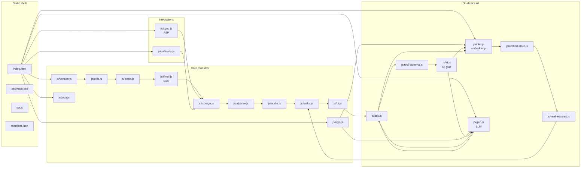

# Architecture



## Load order

Scripts in [`index.html`](index.html) run in declaration order. There are no ES modules; files communicate through shared `function` declarations and a few `window.*` exports.

## State

Core mutable state (tasks, timer, goals, lists, …) lives primarily in [`js/timer.js`](js/timer.js). [`js/storage.js`](js/storage.js) snapshots that state to `localStorage` with an IndexedDB mirror and handles migrations.

**Task classifications:** each task may have a `category` string id (life area). Defaults and user overrides live in `cfg.categories` (see [`js/intel-features.js`](js/intel-features.js): `ensureClassificationConfig`, `DEFAULT_CATEGORY_DEFS`). There is no separate `context` field on tasks — location-style grouping uses lists and tags.

## Release identity

[`js/version.js`](js/version.js) sets `window.ODTAULAI_RELEASE`. The service worker cache name in [`sw.js`](sw.js) must stay aligned (see [`tests/version-sync.test.mjs`](tests/version-sync.test.mjs)).

## On‑device intelligence

Two separate Transformers.js pipelines, loaded independently:

| Pipeline | File | Model | Purpose | When it loads |
|---|---|---|---|---|
| Embedding | [`js/intel.js`](js/intel.js) | `Xenova/gte-small` (384‑dim, ~33 MB) | Semantic search, smart‑add, harmonize, auto‑organize, duplicates | First AI feature used |
| Generative (optional, opt‑in) | [`js/gen.js`](js/gen.js) | `Xenova/SmolLM2-360M-Instruct` q4 by default (~230 MB) | Natural‑language "Ask" mode — turns a plain request into a JSON batch of task operations | Only after Settings → Integrations → Generative AI is enabled AND the user clicks *Download* |

Both use **WebGPU when available, WASM fallback everywhere else**. Weights are cached by the browser's HTTP cache (the service worker explicitly does **not** precache CDN model URLs, to avoid exhausting the PWA cache quota on mobile).

### Ask flow (retrieval‑augmented tool calling)

```
user query
   │
   ├──► embedText()  ───►  semanticSearch(query, 10)  ───┐
   │                                                      │
   ├──► top‑20 recently‑modified open tasks  ────────────►│ compact JSON lines (≤200 chars/task, ≤1800 chars total)
   │                                                      │
   ▼                                                      ▼
[ system prompt: enumerate TOOL_SCHEMA + few‑shot ]   [ user prompt: retrieved task snippets + request ]
                          │
                          ▼
                 genGenerate() — streaming
                          │
                          ▼  raw text
               parseOpsJson()  (tolerant; retries at temp=0 on failure)
                          │
                          ▼
               validateOps(raw, ctx)
                          │
      valid ops ─────────┴──────────► acceptProposedOps()
                                             │
                                             ▼
                                   _pendingOps  →  _renderPendingOps()
                                             │
                                             ▼
                                   intelApplyPending()  →  executeIntelOp()
                                             │
                                             ▼
                                        undo stack (10 deep)
```

Safety invariants:

- **Hard cap** of 50 ops per response; ≥51 → whole batch rejected.
- **Every** LLM‑proposed op is filtered through `validateOps()` in [`js/tool-schema.js`](js/tool-schema.js): required fields, enum coercion, id existence checks (against live `tasks[]` / `lists[]`).
- **No auto‑apply, ever** — ops land in the existing preview UI with per‑field checkboxes and the 10‑deep undo stack.
- **Destructive ACK** — any `DELETE_TASK`, or ≥5 `ARCHIVE_TASK` / `CHANGE_LIST` in one batch, triggers an additional confirmation before apply.
- **No outbound calls** beyond the one‑time model weight fetch from the same Hugging Face CDN already used by the embedding model.
