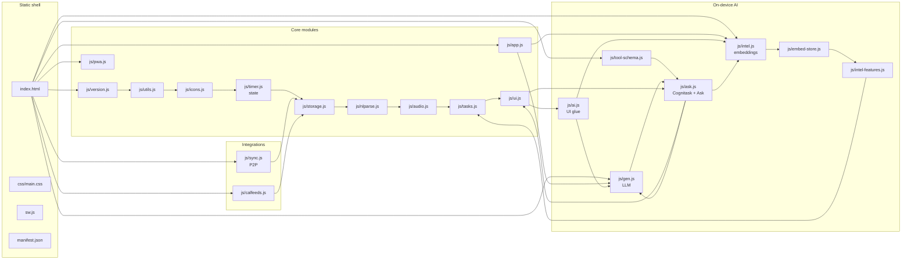

# Architecture



## Load order

Scripts in [`index.html`](index.html) run in declaration order. There are no ES modules; files communicate through shared `function` declarations and a few `window.*` exports.

## State

Core mutable state (tasks, timer, goals, lists, …) lives primarily in [`js/timer.js`](js/timer.js). [`js/storage.js`](js/storage.js) snapshots that state to `localStorage` with an IndexedDB mirror and handles migrations.

**Task classifications:** each task may have a `category` string id (life area). Defaults and user overrides live in `cfg.categories` (see [`js/intel-features.js`](js/intel-features.js): `ensureClassificationConfig`, `DEFAULT_CATEGORY_DEFS`). There is no separate `context` field on tasks — location-style grouping uses lists and tags.

## Release identity

[`js/version.js`](js/version.js) sets `window.ODTAULAI_RELEASE` (the window-global identifier is intentionally left in upper-case after the brand rename — every consumer reads it by this name). The service worker cache name in [`sw.js`](sw.js) must stay aligned (see [`tests/version-sync.test.mjs`](tests/version-sync.test.mjs)).

## On‑device intelligence

Two separate Transformers.js pipelines, loaded independently:

| Pipeline | File | Model | Purpose | When it loads |
|---|---|---|---|---|
| Embedding | [`js/intel.js`](js/intel.js) | WebGPU: `Xenova/gte-base-en-v1.5` (768‑dim, ~110 MB). WASM: `Xenova/bge-small-en-v1.5` (384‑dim) | Semantic search, smart‑add, harmonize, auto‑organize, duplicates, category centroids | First AI feature used |
| Generative (optional, opt‑in) | [`js/gen.js`](js/gen.js) | `HuggingFaceTB/SmolLM2-360M-Instruct` q4 by default (~230 MB); presets include Qwen2.5 0.5B/1.5B | Natural‑language **Ask** (Cmd/Ctrl+K, `?`) — multi‑turn **Cognitask** loop in [`js/ask.js`](js/ask.js) turns requests into validated JSON ops | Only after Settings → Integrations → Generative AI is enabled AND the user clicks *Download* |

Both use **WebGPU when available, WASM fallback everywhere else**. Weights are cached by the browser's HTTP cache (the service worker explicitly does **not** precache CDN model URLs, to avoid exhausting the PWA cache quota on mobile).

### Gen auto‑rehydrate (Ask LLM)

[`js/ai.js`](js/ai.js) defines `genAutoRehydrateIfCached()`: on DOMContentLoaded (after a short delay + `requestIdleCallback` when available), if generative Ask is **enabled**, weights for the selected model are recorded as **downloaded** (`isGenDownloaded`), and the pipeline is not already **ready** for that model, it calls `genLoad()` once. That turns `isGenReady()` true after a full page reload without requiring Settings → **Load** again, as long as the browser HTTP cache still holds the weights. Failures are silent (user can still load manually).

### Cognitask / Ask flow (retrieval‑augmented, multi‑turn)

`cognitaskRun` lives in [`js/ask.js`](js/ask.js) (same script order as the browser; `askRun` is the stable entry point). Read‑only ops (`QUERY_TASKS`, `GET_TASK_DETAIL`, `GET_CALENDAR_EVENTS`, `LIST_CATEGORIES`, `LIST_LISTS` — see `readOnly` in [`js/tool-schema.js`](js/tool-schema.js)) execute immediately; the loop allows up to three read rounds plus a final write turn (enforced by `COGNITASK_MAX_READ_ROUNDS` / `COGNITASK_MAX_TURNS`), then returns write ops for preview.

```
user query
   │
   ├──► embedText()  ───►  semanticSearch(query, 10)  ───┐
   │                                                      │
   ├──► top‑20 recently‑modified open tasks  ────────────►│ compact JSON lines (≤200 chars/task, ≤1800 chars total)
   │                                                      │
   ├──► Calendar (next 7 days) from cal feeds  ────────────►│ capped block in user prompt
   ▼                                                      ▼
[ system prompt: TOOL_SCHEMA + few‑shot ]            [ user prompt: lists + calendar + context + request ]
                          │
                          ▼
                 genGenerate() — streaming (per turn; up to three read rounds plus a final write turn). **Qwen2.5‑1.5B‑Instruct** passes `tools` from `buildOpenAIToolsFromToolSchema()` into `apply_chat_template`; the model replies with `<tool_call>` JSON, parsed by `parseQwen25ToolCallBlocks` (falls back to JSON-array `parseOpsJson` if no tags). Other presets use the all-in-prompt JSON array only.
                          │
            read-only JSON? ──yes──► runReadOp() ──► append tool result; next turn
                          │
                          no (write ops or done)
                          ▼
               parseOpsJson()  (tolerant JSON array)
                          │
                          ▼
               validateOps(writeOps, ctx)
                          │
      valid ops ─────────┴──────────► acceptProposedOps()
                                             │
                                             ▼
                                   _pendingOps  →  _renderPendingOps()
                                             │
                                             ▼
                                   intelApplyPending()  →  executeIntelOp()
                                             │
                                             ▼
                                        undo stack (10 deep)
```

Safety invariants:

- **Hard cap** of 50 ops per response; ops 51+ are recorded as `BATCH_LIMIT` in `rejected[]` and only the first 50 are validated (not an all-or-nothing reject).
- **Every** LLM‑proposed op is filtered through `validateOps()` in [`js/tool-schema.js`](js/tool-schema.js): required fields, enum coercion, id existence checks (against live `tasks[]` / `lists[]`).
- **No auto‑apply, ever** — ops land in the existing preview UI with per‑field checkboxes and the 10‑deep undo stack.
- **Destructive ACK** — any `DELETE_TASK`, or ≥5 `ARCHIVE_TASK` / `CHANGE_LIST` in one batch, triggers an additional confirmation before apply.
- **No outbound calls** beyond the one‑time model weight fetch from the same Hugging Face CDN already used by the embedding model.
