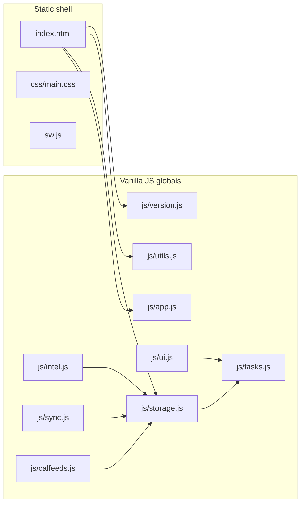

# Architecture

## Load order

Scripts in [`index.html`](index.html) run in declaration order. There are no ES modules; files communicate through shared `function` declarations and a few `window.*` exports.

## State

Core mutable state (tasks, timer, goals, lists, …) lives primarily in [`js/timer.js`](js/timer.js). [`js/storage.js`](js/storage.js) snapshots that state to `localStorage` with an IndexedDB mirror and handles migrations.

## Release identity

[`js/version.js`](js/version.js) sets `window.ODTAULAI_RELEASE`. The service worker cache name in [`sw.js`](sw.js) must stay aligned (see [`tests/version-sync.test.mjs`](tests/version-sync.test.mjs)).
