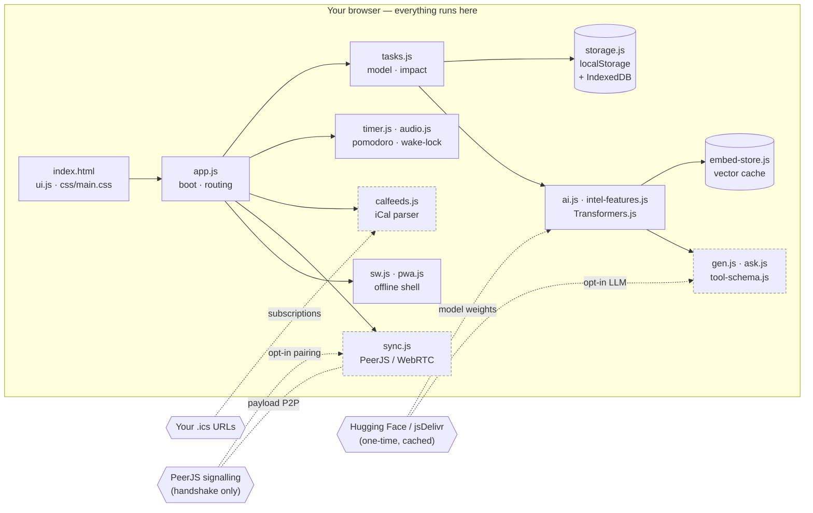

<!--
  ╔══════════════════════════════════════════════════════════════════════════╗
  ║   OdTauLai — On-Device Task App Using Local Ambient Intelligence         ║
  ║   A Pomodoro + ClickUp-style task manager that understands meaning,      ║
  ║   on your device, offline. No accounts. No telemetry. No cloud LLM.      ║
  ╚══════════════════════════════════════════════════════════════════════════╝
-->

<div align="center">


<br />

### **OdTauLai**

**On-Device Task App Using Local Ambient Intelligence**

*A Pomodoro timer and ClickUp-style task manager that understands what your tasks **mean** — on your device, offline, with no account, no telemetry, no cloud LLM.*

<br />

[](LICENSE)
[](#architecture)
[](#privacy-explicitly)
[](#pwa--offline)
[](#pwa--offline)

[](#architecture)
[](#privacy-explicitly)
[](#the-ambient-intelligence-the-headline-feature)
[](#browser-support)
[](#the-ambient-intelligence-the-headline-feature)

<sub>Vanilla JS · No build step · PWA · Offline · ~33 MB on-device model · MIT</sub>

<br />

[**Highlights**](#highlights) · [**Get started**](#getting-started) · [**Privacy**](#privacy-explicitly) · [**Architecture**](#architecture) · [**Cheat sheets**](#keyboard-cheat-sheet) · [**FAQ**](#faq)

</div>

---

## How to say it

> **OdTauLai** → **"ode-TOW-lie"** *(/oʊdˈtaʊlaɪ/)* — two syllables, stress on the middle: *ode* · **Tow** · *lie*.

Prefer letters? `O-D-T-A-U-L-A-I` works too. It's an acronym, so both are fine:

> **O**n-**d**evice **t**ask **a**pp **u**sing **l**ocal **a**mbient **i**ntelligence.

Not a chatbot. Not a wrapper around somebody else's API. Not a subscription. Just a very fast, very private task app that happens to understand the meaning of your tasks — geometrically, in a vector space, right on your machine.

---

## Why OdTauLai

| | Everyone else | **OdTauLai** |
|---|---|---|
| **Data** | Cloud sync, accounts, trackers | Nothing leaves the device. No account. No analytics. |
| **"AI"** | Cloud LLM, your text leaves the device | On-device embeddings. Text stays local. |
| **Footprint** | Heavy SPA, 10 MB of JS, build pipeline | Vanilla JS, no bundler, no framework, no build |
| **Scope** | Timer **or** tasks **or** calendar | Timer + tasks + calendar feeds + P2P sync + AI, one file server |
| **Trust** | Destructive AI "fix it for me" buttons | AI **proposes** updates — you preview, apply, undo |

> [!IMPORTANT]
> **Local-first isn't a marketing word here.** Open the app offline. Read the source. Search the repo for `fetch(`. The only outbound calls are the one-time model download from the Hugging Face CDN (cached forever after) and the optional calendar feeds / P2P sync **you** turn on.

---

## Table of contents

<details>
<summary><b>Click to expand</b></summary>

- [Highlights](#highlights)
  - [The ambient intelligence](#the-ambient-intelligence-the-headline-feature)
  - [Ask — optional on-device LLM](#ask--optional-on-device-llm-off-by-default)
  - [Impact scoring (Pareto 80/20)](#impact-scoring-pareto-8020)
  - [Deep-work timer](#deep-work-timer)
  - [ClickUp-style tasks](#clickup-style-tasks)
  - [Input superpowers](#input-superpowers)
  - [Views & navigation](#views--navigation)
  - [Calendar feeds](#calendar-feeds-read-only-ical--ics)
  - [Optional P2P sync](#optional-p2p-sync-off-by-default)
  - [Data portability](#data-portability)
  - [PWA & offline](#pwa--offline)
  - [Bells, whistles, QoL](#bells-whistles-and-quality-of-life)
- [Getting started](#getting-started)
- [Privacy, explicitly](#privacy-explicitly)
- [Architecture](#architecture)
- [Keyboard cheat sheet](#keyboard-cheat-sheet)
- [Quick-add cheat sheet](#quick-add-cheat-sheet)
- [Browser support](#browser-support)
- [FAQ](#faq)
- [Not in scope](#not-in-scope-deliberately)
- [Contributing](#contributing)
- [License](#license)

</details>

---

## Highlights

### The ambient intelligence (the headline feature)

A compact sentence-embedding model — **`Xenova/gte-small`**, 384 dimensions, about 33 MB — loads into your browser via **Transformers.js**. Every task title + description is encoded into a vector. Cosine similarity in that vector space lets the app reason about **meaning and context**, not just keywords.

Runs on **WebGPU** when available, **WASM** everywhere else (including iPhone). First load downloads the model weights from the Hugging Face / jsDelivr CDN; after that it's cached by the browser and the app is fully offline.

What you actually get from it:

- **Semantic search** — toggle `◎ Semantic` next to the search box. `"bills"` finds `"pay the electricity"`.
- **Smart-add suggestions** — type a new task and the app predicts life area, priority, effort, energy, tags, and target list from your existing tasks via kNN.
- **Harmonize all fields** — one click proposes updates for every task: values (Schwartz), life area, priority, effort, energy, tags (merged, never wiped). Preview diffs. Apply what you want. Undo the last 10 batches.
- **Auto-organize into lists** — route tasks to the list whose name + description matches best. Preview before apply.
- **Duplicate detection** — near-duplicate pairs by cosine ≥ 0.9, with archive-and-merge flow.
- **Similar tasks** — top neighbors surface in the task detail drawer.
- **Align values only** — narrow button for Schwartz-only alignment if you don't want other fields touched.

The "understanding" is geometric by default. An **optional** tiny on-device LLM (see *Ask* below) is strictly opt-in, local-only, and gated behind an explicit Settings toggle plus an explicit download click — no cloud LLM, no calls to OpenAI / Anthropic / anyone.

### Ask — optional on-device LLM (off by default)

Turn on **Settings → Integrations → Generative AI (beta)** and click *Download model* to enable a natural-language interface:

- Open the command palette (`Cmd/Ctrl + K`), prefix your input with `?`, or click the **Ask** toggle.
- Type a plain-English request: *"make everything tagged #work due tomorrow urgent"*, *"archive all done errands from last week"*, *"create a task 'call mom' tomorrow evening"*.
- The model (default **`Xenova/SmolLM2-360M-Instruct`**, ~230 MB q4, Apache-2.0) runs locally via Transformers.js — **WebGPU** when available, **WASM** everywhere else. iOS Safari works; expect slower first-token latency on WASM.
- Output is a **JSON batch of the same task operations the UI already executes** (create, update, mark done, archive, move, tag, etc.). Nothing auto-applies — every proposed change lands in the existing preview pane with per-field checkboxes, destructive-action ACK, and the 10-deep undo stack.

| Preset | Model | Size (q4) | Best for |
|---|---|---|---|
| Tiny | SmolLM2-135M-Instruct | ~90 MB | Older phones, fast first token |
| **Balanced** *(default)* | **SmolLM2-360M-Instruct** | **~230 MB** | **Most devices** |
| Bigger | Qwen2.5-0.5B-Instruct | ~360 MB | Desktops with WebGPU |

Clear the LLM via your browser's "clear site data" — weights live in the browser HTTP cache, not IndexedDB. Same privacy posture as the embedding model: no task text ever leaves the device.

### Impact scoring (Pareto 80/20)

A derived impact score ranks every active task from signals you already have — priority, due urgency, **how many other tasks this one unblocks**, values alignment, starred, **multiplied by an effort inverse** (`xs → 1.35x`, `xl → 0.7x`). Classic 80/20: high output, low input, rises.

- Smart view chip **`⚡ Impact`** — live count of the top ~20% (capped at 20).
- Sort option **`Sort: Impact (Pareto 80/20)`**.
- Inline **`⚡ impact`** badge on items in the top set, tooltip shows the numeric score.
- No new fields on tasks. No persisted state. Recomputed each render from live data.

### Deep-work timer

- **Pomodoro** with Focus / Short Break / Long Break and auto-cycle, configurable per-phase durations, long-break cadence.
- **Quick Timers** — spawn multiple named countdowns (tea, pasta, stretch) with presets from 1 min → 1 hr.
- **Stopwatch** with laps.
- **Repeating chimes** (e.g. posture check every 15 min).
- **Background-safe audio** — timers still chime when the tab is minimized: audio events are pre-scheduled on the Web Audio clock (immune to `setInterval` throttling), a silent 20 Hz oscillator keeps the tab alive, **Media Session API** puts controls in the OS, **Wake Lock** on mobile.
- **Floating mini timer** overlay that stays visible when you switch away from the Timer tab.

### ClickUp-style tasks

- **Nested subtasks**, arbitrary depth, collapsible.
- **Statuses**: Open / In Progress / Review / Blocked / Done — cycle with a click.
- **Priorities**: Urgent / High / Normal / Low / None with coloured left-stripe.
- **Due dates** with smart chips (overdue / today / soon / future), **start dates**, **reminders**, **recurring** (daily / weekdays / weekly / monthly).
- **Tags**, **starred pins**, **per-task time tracking** with rollup from subtasks.
- **Blockers** (`blockedBy`) — real dependency graph, used by the impact score.
- **Effort** (xs/s/m/l/xl), **energy level**.
- **Life areas** — seven default groups (customizable labels, icons, and accent colors in Settings → Classifications): *Body, Mind & Spirit* (purple), *Relationships* (red), *Community* (amber), *Job, Learning & Finances* (green), *Interests* (blue), *Personal Care* (pink), *General* (gray). Each can carry optional descriptive "core values" metadata (distinct from Schwartz alignment below).
- **Values alignment** (Schwartz human values) per task.
- **Checklists**, **notes**, **URL**, **completion notes** per task.
- **Multiple lists** with colours and descriptions (descriptions drive AI list routing).

### Input superpowers

- **Natural-language quick add** (via `chrono-node`):
  `Buy milk tomorrow @urgent #shopping !star ~daily`
- **Bulk paste import** — paste multi-line text into the task input, a preview modal opens with one task per line; edit before committing. Skips lines >200 chars.
- **Smart-add enhancement** — hit the `✦` button next to the input to prefill life area, priority, tags, and list from embeddings before you submit.
- **Drag-and-drop reorder**, subtask drop, list drop.
- **Mobile swipe gestures** — swipe right to complete, swipe left to archive, with haptic feedback.

### Views & navigation

- **List / Board (kanban) / Calendar** — all three, switchable, keyboard-accessible.
- **Smart views**: All, Today, Week, Overdue, Unscheduled, Starred, **Impact (Pareto)**, **Habits** (recurring / `~daily` etc.), Completed, Archive.
- **Hide recurring from main lists** — optional (on by default): daily/weekly habits stay out of All/Today/Week/etc. and show in **Habits**; open **Filters** → **Display** → uncheck **Hide recurring from main** to mix them into main views.
- **Group by** priority, status, due date, or list.
- **Command palette** (`Cmd / Ctrl + K`) — fuzzy over tasks, actions, views, lists, AI commands, theme, sort, sync, everything.
- **Dark and light themes** with a one-key toggle.
- **Responsive** down to 320 px; touch-first on mobile; full keyboard on desktop.

### Calendar feeds (read-only iCal / ICS)

- Subscribe to any public `.ics` URL — Google Calendar, Outlook, Fastmail, Proton, personal CalDAV exports.
- Parsed entirely in the browser (full VEVENT / VTIMEZONE / RRULE / EXDATE expansion, 180-day window).
- Events appear alongside your tasks in the Calendar view.
- Per-feed colour and visibility toggle.

### Optional P2P sync (off by default)

- **WebRTC via PeerJS** — paste a short code on your second device, they're linked.
- **Zero server-side state** — the PeerJS signalling server brokers the handshake; your task payload goes direct device-to-device.
- **Beta** — you can turn it off, wipe, and forget it ever existed.

### Data portability

- **Export**: full JSON (everything), CSV (spreadsheet), Markdown (human-readable).
- **Import**: JSON round-trips perfectly; CSV and plain-text task lists import cleanly.
- **Clear all** with confirmation — real delete, nothing hiding on a server.

### PWA & offline

- Installs as a standalone app on Chrome/Edge/Safari/Firefox (desktop), iOS Safari (Add to Home Screen), Android Chrome.
- **Works offline** after first visit — service worker precaches the shell.
- **Manifest shortcuts**: jump straight to "Focus Timer" or "New Task" from the OS app icon.
- **Launch handler** — deep links focus the existing window instead of spawning duplicates.

### Bells, whistles, and quality-of-life

- **Undo stack** for AI batches (last 10).
- **Save indicator** shows only on user-initiated saves, throttled to 4 s, auto-hides after 900 ms — no nagging.
- **Today banner** — only shown when there's something urgent (overdue or due-today). Zero noise when your day is clean.
- **Storage telemetry** — Settings shows IndexedDB quota, whether persistent storage is granted, online/offline state.
- **Optional persistent storage** prompt so "Clear browsing data" doesn't nuke your tasks.
- **Haptic feedback** on destructive mobile gestures.
- **Accessibility**: `aria-live` regions for the AI status chip, semantic search gated with a visible disabled state when the model isn't ready, focusable and keyboard-navigable everywhere.

---

## Getting started

### The 10-second path

```bash
git clone https://github.com/<you>/STUPInD.git OdTauLai
cd OdTauLai
python3 -m http.server 8080
# open http://localhost:8080
```

Or just **double-click `index.html`** — it works from `file://` too. You lose service-worker offline and PWA install, but everything else runs.

### One-click deploys

| Host | Command | Notes |
|---|---|---|
| **Netlify Drop** | drag the repo to https://app.netlify.com/drop | 30 seconds, free, HTTPS |
| **GitHub Pages** | push, enable Pages on `main /` | free, permanent URL |
| **Vercel** | `npx vercel` | free, instant |
| **Cloudflare Pages** | connect GitHub, no build command, output `/` | free, great custom domains |
| **Caddy** | `caddy file-server --domain example.com --root .` | auto-HTTPS one-liner |

Full walkthroughs with Nginx configs, troubleshooting, custom icons, and manifest `id` guidance live in **[DEPLOY.md](DEPLOY.md)**.

### Install as an app

<details>
<summary><b>Per-platform install instructions</b></summary>

| Platform | How |
|---|---|
| Chrome / Edge desktop | Click the install icon in the address bar |
| Safari macOS | File → Add to Dock |
| iOS Safari | Share → Add to Home Screen |
| Android Chrome | ⋮ → Install app |
| Firefox desktop | Address bar install icon (desktop only) |

</details>

---

## Privacy, explicitly

> [!NOTE]
> **OdTauLai does not** collect any data, send your tasks anywhere, use analytics / tracking / cookies, require an account / email / phone, or sync across devices unless you explicitly opt into the beta P2P feature.

**OdTauLai does:**

- store app state in `localStorage`,
- store the embedding cache in `IndexedDB`,
- fetch the embedding model once from the Hugging Face / jsDelivr CDN, then cache it,
- fetch calendar feeds you subscribe to (those servers see you),
- open a WebRTC connection to a device you explicitly pair with (PeerJS signalling server sees the handshake, not the payload).

To audit outbound traffic yourself, search the source for `fetch(`, dynamic `import(`, `XMLHttpRequest`, and `new WebSocket(` — the embedding stack also loads workers/modules from CDNs, and PeerJS uses WebSockets internally for signalling when sync is enabled.

---

## Architecture

No framework, no bundler, no transpiler. Just **HTML, CSS, and vanilla JS modules** loaded in order from `index.html`.



<sub>Dashed boxes = strictly opt-in. Nothing connects out unless you turn it on.</sub>

<details>
<summary><b>Source tree</b></summary>

```
OdTauLai/
├── index.html                single source of truth for the UI
├── manifest.json             PWA manifest
├── sw.js                     service worker (shell precache)
├── css/main.css              themed design system with CSS variables
├── js/
│   ├── version.js            release id (keep in sync with sw.js cache name)
│   ├── utils.js              helpers, date, DOM
│   ├── storage.js            localStorage + IndexedDB persistence
│   ├── nlparse.js            natural-language quick-add (chrono-node)
│   ├── tasks.js              task model, filtering, sorting, impact scoring
│   ├── timer.js              pomodoro, quick timers, stopwatch, chimes
│   ├── audio.js              Web Audio scheduling + wake-lock
│   ├── ui.js                 renderers, command palette, task item
│   ├── ai.js                 Transformers.js pipeline, semantic features
│   ├── intel.js              intelligence bootstrap + status
│   ├── intel-features.js     harmonize, auto-organize, duplicates
│   ├── embed-store.js        IndexedDB vector cache
│   ├── gen.js                optional local LLM loader (opt-in, off by default)
│   ├── ask.js                NL → op batch orchestrator (retrieval + prompt)
│   ├── tool-schema.js        JSON-schema + validator for LLM tool calls
│   ├── calfeeds.js           iCal / ICS parser + renderer
│   ├── sync.js               WebRTC P2P (PeerJS)
│   ├── pwa.js                service-worker registration + update flow
│   ├── app.js                boot, version, routing
│   └── vendor/peerjs.min.js  offline fallback for P2P signalling client
├── icons/                    PWA icons (192, 512, maskable, apple-touch, etc.)
├── DEPLOY.md
└── README.md
```

</details>

**Runtime dependencies** are loaded from CDNs on demand, never bundled:

| Library | Purpose | When it loads |
|---|---|---|
| [`@huggingface/transformers`](https://huggingface.co/docs/transformers.js) | on-device embeddings | first time you use an AI feature |
| [`Xenova/gte-small`](https://huggingface.co/Xenova/gte-small) | 384-dim sentence embedding model (~33 MB) | first AI feature use, then cached |
| [`chrono-node`](https://github.com/wanasit/chrono) | natural-language dates | first time you quick-add with dates |
| [`peerjs`](https://peerjs.com/) | WebRTC signalling client | only if you enable P2P sync |

Everything else is hand-written.

---

## Keyboard cheat sheet

| Action | Shortcut |
|---|---|
| Command palette | <kbd>Cmd/Ctrl</kbd> + <kbd>K</kbd> |
| Go to Tasks / Focus / Tools / Data / Settings | <kbd>1</kbd> / <kbd>2</kbd> / <kbd>3</kbd> / <kbd>4</kbd> / <kbd>5</kbd> *(from palette)* |
| Toggle theme | palette → "Toggle theme" |
| Toggle semantic search | palette → "Toggle semantic search" |
| Impact view | palette → "Impact view" |
| Sort by Impact | palette → "Sort by Impact" |
| Start / stop focus timer | palette → "Start focus timer" |
| Add new list | palette → "Add new list" |
| Find duplicates | palette → "Find duplicate tasks" |
| Harmonize all fields | palette → "Harmonize all fields" |

All palette actions fuzzy-match — you rarely need to remember the exact label.

## Quick-add cheat sheet

```text
Buy milk tomorrow @urgent #shopping !star ~daily
│        │        │       │         │     └─ recurrence: daily | weekdays | weekly | monthly
│        │        │       │         └─ star flag
│        │        │       └─ tag
│        │        └─ priority: urgent | high | normal | low
│        └─ date: natural language (chrono-node — "next Monday at 3pm", "in 2 hours", …)
└─ task name
```

Paste multiple lines at once for **bulk import** — you'll get a preview modal.

---

## Browser support

| Browser | Local use | PWA install | Background audio | Offline | WebGPU AI |
|---|:---:|:---:|:---:|:---:|:---:|
| Chrome / Edge desktop | ✓ | ✓ | ✓ *(while open)* | ✓ | ✓ |
| Chrome Android | ✓ | ✓ | ✓ *(while open)* | ✓ | partial |
| Safari macOS | ✓ | ✓ | ✓ | ✓ | ✓ *(17+)* |
| Safari iOS | ✓ | Add to Home | limited | ✓ | WASM fallback |
| Firefox | ✓ | desktop only | ✓ | ✓ | WASM fallback |

The AI falls back from **WebGPU → WASM** automatically; no action required from you.

---

## FAQ

<details>
<summary><b>Is my task text ever sent to a server?</b></summary>

No. The embedding model runs locally via Transformers.js. The only outbound calls are the one-time model download from Hugging Face / jsDelivr and whatever integrations you explicitly enable (calendar feeds, P2P sync).

</details>

<details>
<summary><b>Why a small embedding model instead of a chat LLM?</b></summary>

Chat LLMs (a) don't fit on a phone, (b) need to talk to a cloud, (c) invent plausible nonsense ("hallucinate"), and (d) are overkill for "what does this task mean?". A 33 MB embedding model answers that question deterministically, on-device, in milliseconds, without generating anything.

</details>

<details>
<summary><b>How do I get the AI features to work?</b></summary>

Open the **Tools** tab. The embedding model downloads on first use (one time, ~33 MB). After that, everything is instant. A status chip in the header shows load progress; click it to retry if something fails.

</details>

<details>
<summary><b>Will clearing site data delete my tasks?</b></summary>

Yes — grant **persistent storage** in Settings to prevent this. Or export JSON periodically; it round-trips perfectly.

</details>

<details>
<summary><b>Can I sync across devices without the cloud?</b></summary>

Yes — the beta P2P sync uses WebRTC. Your data goes peer-to-peer; only the handshake touches a signalling server.

</details>

<details>
<summary><b>How do I run this on a corporate network that blocks CDNs?</b></summary>

Host `@huggingface/transformers`, the model files, `chrono-node`, and `peerjs` yourself; update the CDN URLs in `js/ai.js`, `js/nlparse.js`, and `js/sync.js`.

</details>

<details>
<summary><b>Can I remove the AI entirely?</b></summary>

Yes — it's strictly opt-in. If you never visit the Tools tab or toggle semantic search, the embedding model never downloads. If you never enable *Generative AI* in Settings, no LLM downloads either. To strip the code entirely, delete `js/ai.js`, `js/intel.js`, `js/intel-features.js`, `js/embed-store.js`, `js/gen.js`, `js/ask.js`, `js/tool-schema.js` and remove their `<script>` tags.

</details>

<details>
<summary><b>Why vanilla JS?</b></summary>

Frameworks rot. `git clone`, open in any browser, and in 10 years this will still work. No npm install, no lockfile drift, no "recompile the universe to change a button."

</details>

---

## Not in scope (deliberately)

- **Cloud** LLMs — inference always happens on the device you're using.
- Free-form chat loops, persistent conversation memory, or "assistant" personalities. The optional Ask feature is one-shot: query → proposed ops → you review & apply.
- Cloud accounts, user profiles, team features.
- Analytics. Telemetry. A/B tests. "Engagement."
- Push notifications to your phone while the app is fully closed (browsers don't allow this without a cloud backend — by design).

If you need any of the above, this isn't the right app. That's the point.

---

## Contributing

> [!NOTE]
> **Git hygiene confession:** For large stretches of this repo's life I treated `main` like the only lane on the highway — straight commits, no scenic detours through feature branches. That is *not* how the textbooks say to do it; it is how you ship when your branching strategy is "hope and `git push`." If you contribute here, feel free to be the responsible one and use PRs — I'll wave from the shoulder lane.

Pull requests welcome. Keep it:

- **vanilla** (no framework, no build step),
- **local-first** (no new outbound calls without an opt-in),
- **small** (every feature earns its kilobytes),
- **accessible** (keyboard and screen reader).

Before committing, run `node --check` on the same file list as [`.github/workflows/ci.yml`](.github/workflows/ci.yml) (or copy the one-liner from that workflow), then **`npm test`** (runs [`scripts/run-tests.mjs`](scripts/run-tests.mjs) so tests behave the same on Windows, macOS, and CI). Full verification is still manual: 360 / 390 / 640 / 960 widths, both themes, `file://` and HTTPS, first-load embedding progress visible, PWA install still works.

See also: **[CONTRIBUTING.md](CONTRIBUTING.md)** · **[ARCHITECTURE.md](ARCHITECTURE.md)** · **[SECURITY.md](SECURITY.md)** · **[DEPLOY.md](DEPLOY.md)**.

---

## License

**MIT.** Do what you want. Attribution appreciated but not required. See [LICENSE](LICENSE).

---

## Credits

Built with:

- [Transformers.js](https://huggingface.co/docs/transformers.js) — on-device inference.
- [`Xenova/gte-small`](https://huggingface.co/Xenova/gte-small) — the embedding model.
- [chrono-node](https://github.com/wanasit/chrono) — natural-language date parsing.
- [PeerJS](https://peerjs.com/) — WebRTC signalling client.

Inspired by ClickUp, Things, Todoist, OmniFocus, and the long-standing tradition of Pomodoro apps that don't need an account.

Everything else — vanilla HTML, CSS, JS, and a lot of care.

<div align="center">

<br />

<sub>Built with intent. Runs on your device. Owes you nothing.</sub>

<sub>**OdTauLai** — *ode-TOW-lie*</sub>

</div>
